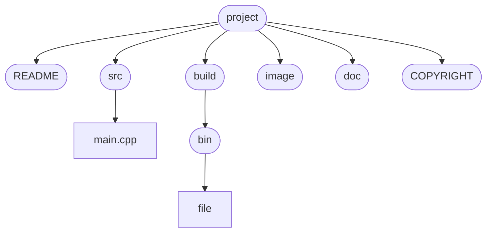

# 使用说明
## 1. 项目简介

​		本项目通过调用`python`相关的加密库，实现各类加密算法，比较其在效率上的差异，从而设计工业控制信息物理系统网络结构中各层的加密方式。

## 2. 环境配置

1. 运行环境： `python3`
2. 使用的库： `pycryptodome, hmac, hashlib, pdfplumber, numpy，matplotlib`
3. 库的安装： `pip install -i`

## 3. 工程目录

​	|— `README.md`
​	|— `src` 
​      	  |— `main.cpp`
​	|— `build`
​			|— `bin`
​					|— `<executable file>`
​	|— `image`
​			|— `image.jpg`
​	|— `doc`
​			|— `main.txt`
​	|— `COPYRIGHT`



## 4. 运行命令

```shell
# 根据CMakeLists.txt进行编译
cd build
cmake ..
make
# 在binary目录下运行可执行文件
cd bin
./<executable file>	
```

## 5. 版本

​	$date:6.14$

​	$V1.0$		实现各类加密方法

​	$V1.0.1$    添加注释，修改部分bug

​	$V1.1$        封装，在主函数中实现功能

​	$V1.2$        将加密和解密结果存入`cipher.txt`

​	$V1.2.1$     将`RSA`加密算法中随机生成的公钥私钥对存入`key`

​	$date:6.19$

​	$V2.0$        对大量的数据进行加密，测算每种加密方法的运行时间

​	$V2.1$        加密效率的效果对比可视化

​	$V2.1.1$     对各模块添加详细注释

## 6. 作者

​	`HTY`

## 7. 贡献者

​	`DYH,LMC,PH`

## 8. 参考

​	`CSDN`各路神仙

​	`GitHub`源代码
