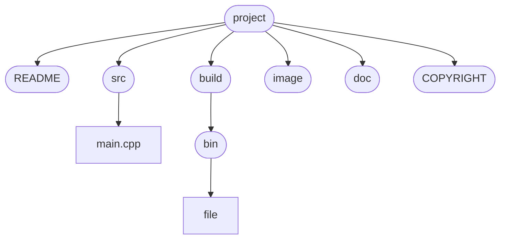

# 使用说明
## 1. 项目简介

​  `README` TEMPLATE

## 2. 环境配置

1. 运行环境： `python3`, `gcc/g++`, `cmake3.2`
2. 使用的库： `pycryptodome, hmac, hashlib, pdfplumber, numpy，matplotlib`
3. 库的安装： `pip install -i`

## 3. 工程目录

​	|— `README.md`
​	|— `src` 
​      	  |— `main.cpp`
​	|— `build`
​			|— `bin`
​					|— `<executable file>`
​	|— `image`
​			|— `image.jpg`
​	|— `doc`
​			|— `main.txt`
​	|— `COPYRIGHT`



## 4. 运行命令

```shell
# 根据CMakeLists.txt进行编译
cd build
cmake ..
make
# 在binary目录下运行可执行文件
cd bin
./<executable file>	
```

## 5. 版本

​	date: 2022.2.25

​	v1.0

## 6. 作者

​	`HTY`

## 7. 贡献者


## 8. 参考


